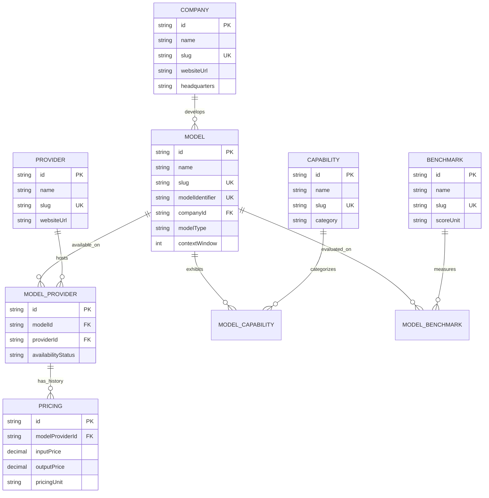

# Entity Relationships — OneAtlas

```mermaid
erDiagram
    COMPANY ||--o{ MODEL : "develops"
    MODEL ||--o{ MODEL_PROVIDER : "available_on"
    PROVIDER ||--o{ MODEL_PROVIDER : "hosts"
    MODEL_PROVIDER ||--o{ PRICING : "has_history"
    MODEL ||--o{ MODEL_CAPABILITY : "exhibits"
    CAPABILITY ||--o{ MODEL_CAPABILITY : "categorizes"
    MODEL ||--o{ MODEL_BENCHMARK : "evaluated_on"
    BENCHMARK ||--o{ MODEL_BENCHMARK : "measures"

    COMPANY {
        string id PK
        string name
        string slug UK
        string websiteUrl
        string headquarters
    }

    MODEL {
        string id PK
        string name
        string slug UK
        string modelIdentifier UK
        string companyId FK
        string modelType
        int contextWindow
    }

    PROVIDER {
        string id PK
        string name
        string slug UK
        string websiteUrl
    }

    MODEL_PROVIDER {
        string id PK
        string modelId FK
        string providerId FK
        string availabilityStatus
    }

    PRICING {
        string id PK
        string modelProviderId FK
        decimal inputPrice
        decimal outputPrice
        string pricingUnit
    }

    CAPABILITY {
        string id PK
        string name
        string slug UK
        string category
    }

    BENCHMARK {
        string id PK
        string name
        string slug UK
        string scoreUnit
    }
```
